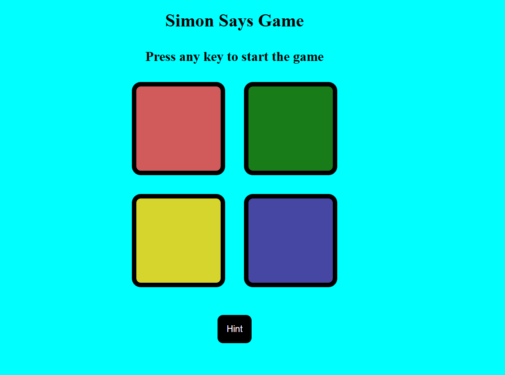

# 🎮 Simon Says Game

A fun and interactive memory game built with HTML, CSS, and JavaScript. Test your memory as you follow and repeat the sequence of lights and sounds!

## 🔗 Live Demo

👉 [Play the Game](https://yourusername.github.io/SimonSayGame/)

*(Replace with your actual GitHub Pages link)*

---

## 📸 Screenshot



---

## 🧠 How to Play

1. Click **Start** to begin the game.
2. Watch the pattern of colors that light up.
3. Repeat the exact sequence by clicking on the buttons in order.
4. With every level, the pattern gets longer.
5. Make a mistake and it's game over!

---

## 🚀 Features

- Dynamic sound and light effects
- Difficulty increases with each level
- Responsive UI for all screen sizes
- Simple and addictive gameplay

---

## 💻 Tech Stack

- **HTML5**
- **CSS3**
- **JavaScript (Vanilla)**

---

## 📁 Project Structure

```bash
SimonSayGame/
├── index.html
├── styles.css
├── script.js
├── README.md
└── assets/
    └── sounds/
    └── images/
